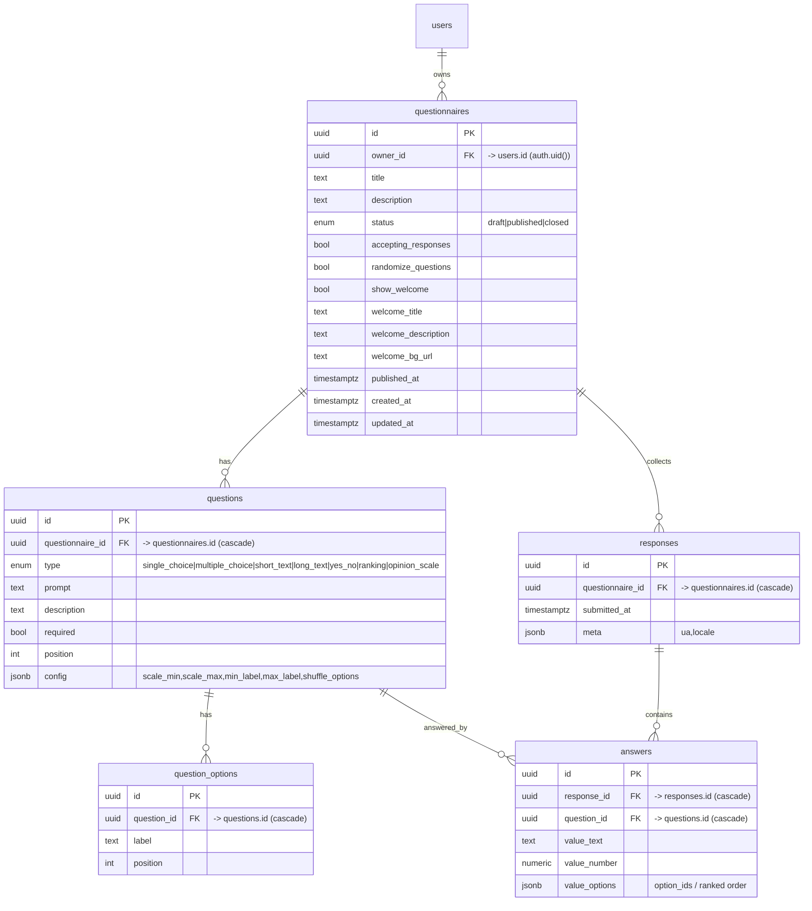

# Questionnaire Constructor — Database ERD

> Reference for the survey/questionnaire data model. See
> [`plans/questionnaire-constructor.prd.md`](../plans/questionnaire-constructor.prd.md)
> for the product spec.

## Entity-Relationship Diagram

## Tables

| Table | Role |
|---|---|
| `questionnaires` | Owner-scoped aggregate root. Welcome screen, lifecycle status, and randomize flags inline (1:1, no joins). `published_at` marks go-live. |
| `questions` | Polymorphic via `type` enum + `config` JSONB → new types need no schema change. `position` is canonical order (randomization is render-time only). |
| `question_options` | Normalized options for choice/ranking types so `answers` can FK a stable option id. |
| `responses` | One submission. `meta` JSONB holds `{ua, locale}`. |
| `answers` | One row per answered question. Typed `value_text`/`value_number` + `value_options` JSONB for variable-shape answers. |

## Enums

- `questionnaire_status`: `draft` \| `published` \| `closed`
- `question_type`: `single_choice` \| `multiple_choice` \| `short_text` \| `long_text` \| `yes_no` \| `ranking` \| `opinion_scale`

## Answer encoding by question type

| Type | Column(s) used | Shape |
|---|---|---|
| `single_choice` | `value_options` | `[option_id]` |
| `multiple_choice` | `value_options` | `[option_id, ...]` |
| `short_text` / `long_text` | `value_text` | free text |
| `yes_no` | `value_text` | `'yes'` \| `'no'` |
| `ranking` | `value_options` | `[option_id, ...]` (array index = rank) |
| `opinion_scale` | `value_number` | integer within `config` bounds |

## Constraints, indexes, triggers

- FKs cascade down the tree (delete questionnaire → questions → options; delete response → answers).
- `unique(questionnaire_id, position)` on `questions`; `unique(question_id, position)` on `question_options`.
- Indexes: `answers(question_id)`, `answers(response_id)`, `responses(questionnaire_id)`, `questions(questionnaire_id, position)`.
- `updated_at` auto-touch trigger on mutable tables.
- **Lock trigger**: BEFORE UPDATE/DELETE on `questions`/`question_options` and structural columns of `questionnaires` — reject if any `responses` row exists for that questionnaire. Status / `accepting_responses` / welcome-text edits stay allowed.

## RLS summary

| Table | Owner (`auth.uid()`) | Anon (public key) |
|---|---|---|
| `questionnaires` | ALL where `owner_id = auth.uid()` | SELECT where `status='published'` |
| `questions` | ALL via parent ownership | SELECT where parent published |
| `question_options` | ALL via parent ownership | SELECT where parent published |
| `responses` | SELECT via parent ownership | none (writes via RPC) |
| `answers` | SELECT via parent ownership | none (writes via RPC) |

## RPCs

- **`submit_response(p_questionnaire_id uuid, p_answers jsonb) returns uuid`** —
  SECURITY DEFINER, granted to `anon`. Validates published + `accepting_responses`,
  all `required` answered, option ids belong to their question, scale within bounds.
  Inserts `responses` + `answers` in one transaction; returns `response_id`.
- **`get_questionnaire_stats(p_questionnaire_id uuid) returns jsonb`** —
  SECURITY DEFINER, granted to `authenticated`, asserts `owner_id = auth.uid()`.
  Returns per-question aggregates (option counts, scale histogram + avg, yes/no
  counts, text-answer list, ranking average rank).
